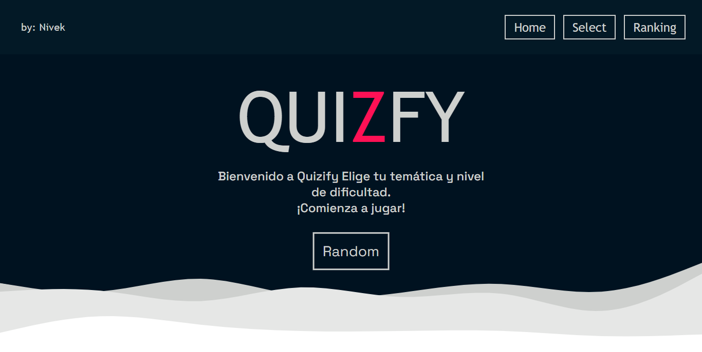
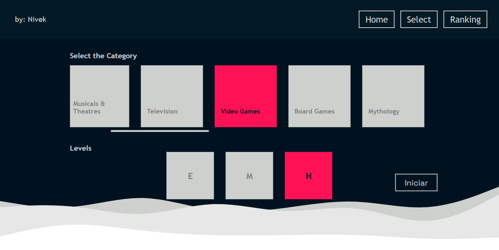
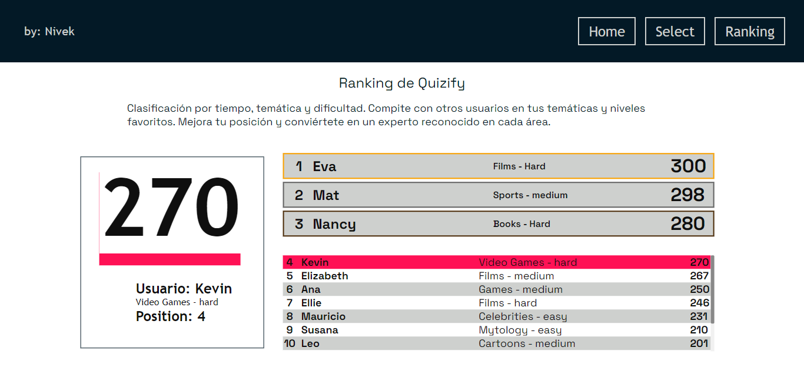

# React + Vite

This template provides a minimal setup to get React working in Vite with HMR and some ESLint rules.

# Descripcion:
## QUIZFY
Aplicación en desarrollo que tiene como objetivo proporcionar cuestionarios interactivos y variados para cada ocasión en que se juegue.

## Diseño Preliminar
A partir de este momoento se creo una plantilla de como se espera que sea el diseño del proyecto, para dar una idea asi como los colores elejidos.

[Quiz](../Captura/QUIZFY.pdf)

## Tecnologías Implementadas
### Frontend 
  - React con Vite: Utilizados para la creación de la interfaz de usuario.
  - Frame-Motion: Para animaciones fluidas y atractivas.
  - FontAwesome: Para iconos y gráficos.
  - Dotenv: Para manejar variables de entorno en el frontend.
  - React-Router-Dom: Para la gestión de la navegación en la aplicación.
  - Sass: Para el preprocesamiento de CSS.
  - Axios: Para realizar solicitudes HTTP.

### Backend 
  - Express: Framework para el desarrollo del servidor.
  - Axios: Para realizar solicitudes HTTP.
  - CORS: Middleware para permitir el intercambio de recursos entre dominios.

## Configuración del Entorno
Para configurar el entorno de desarrollo del backend, es necesario crear un archivo .env dentro de la carpeta backend/ especificando el usuario y la contraseña para conectarse a MongoDB Atlas.asi como el puerto en el cual estara en Escucha. El archivo .env debe contener las siguientes variables:

```
[.env]
PORT = 4000
MONGODB_URI = mongodb+srv://<user>:<password>@quiz.cob30po.mongodb.net/?retryWrites=true&w=majority&appName=Quiz
```
NOTA: Este solo es un ejemplo de lo esperado en .env

Estructura de la Base de Datos MongoDB (document)
La base de datos en MongoDB Atlas debe seguir la siguiente estructura:

```json
Copiar código
{
  "name": "nombre",
  "category": "categoria",
  "level": "nivel de dificultad",
  "score": "puntaje"
}
```

Desarrollo Futuro
Actualmente, el proyecto está en desarrollo y se planea integrar la API de Trivia para generar preguntas variadas cada vez que se juegue.

## CAPTURAS HASTA EL MOMENTO:








