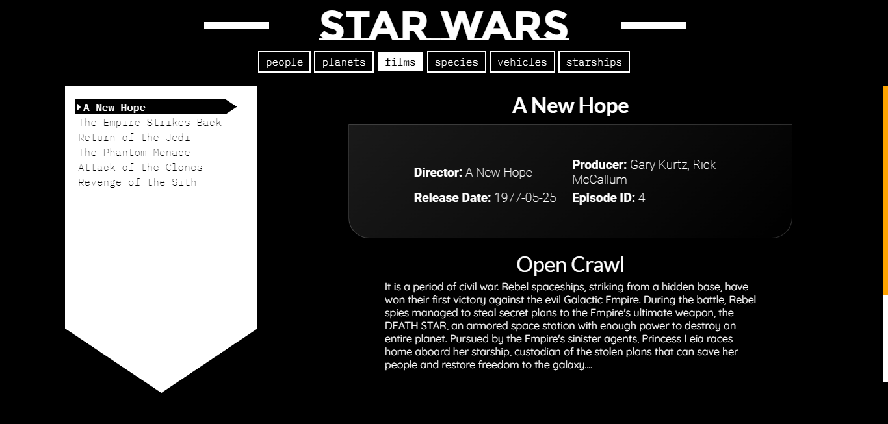
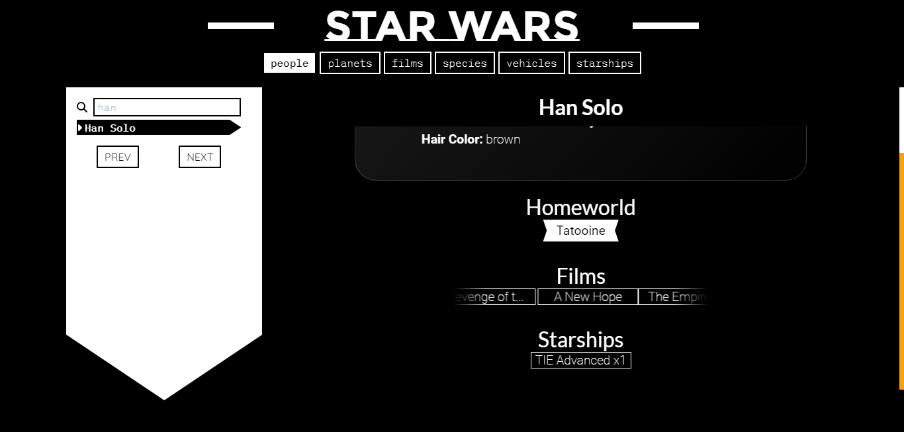

#  Proyecto de Práctica con Mouredev

Este repositorio tiene como finalidad practicar mediante los proyectos proporcionados por el desarrollador [Mouredev](https://retosdeprogramacion.com/proyectos/). Se tratará de resolver los diferentes retos y ejercicios utilizando distintos lenguajes de programación y herramientas.

##  Descripción

La práctica incluye la implementación de diversos proyectos propuestos por Mouredev, abordándolos con una variedad de tecnologías para mejorar y diversificar nuestras habilidades en programación. Cada proyecto tendrá su propia carpeta con la solución correspondiente en uno o varios lenguajes de programación.

##  PROYECTO 1 >> CONECTA 4 
## Descripcion:
/*
 * Crea el juego conecta cuatro.
 *
 * Requisitos:
 * - Tablero de 7x6 (7 en el eje "x" y 6 en el "y").
 * - Fichas Rojas y Amarillas. La primera partida la comienza siempre la Roja
 *   (la segunda la Amarilla, la tercera la Roja...).
 * - No hay que implementar una funcionalidad que te permita jugar contra la App.
 *   Se asume que jugarán dos personas reales alternándose.
 * - Al seleccionar la columna se coloca la ficha en la parte inferior.
 * - Guardar el número partidas ganadas de cada equipo mientras la App no se finaliza.
 * - Dos botones para reiniciar la partida en marcha y para resetear el
 *   contador de victorias y derrotas.
 * - Puedes añadirle todas las funcionalidades extra que consideres.
 */
 
## REACT - VITE

## C++ | SDL2

#  PROYECTO 2 "ENCICLOPEDIA STAR WARS"

## Descripcion:

/*
 * Crea una app que sirva para listar los personajes de Star Wars y que te permita
 * buscarlos por nombre.
 *
 * Requisitos:
 * - Usa el API https://swapi.dev
 * - El diseño es de libre elección.
 * - Debe mostrar un listado y un detalle de cada personaje.
 * - El listado tendrá que estar paginado.
 * - El listado poseerá un filtro de búsqueda.
 * - Al seleccionar un personaje del listado, el detalle mostrará los datos que
 *   consideres oportunos.
 * - OPCIONAL: Detalle de películas, vehículos, naves, especies...
 * - OPCIONAL: Foto de cada personaje.
 */

 ##REACT | VITE
| Characters | Planets |
|----------|----------|
|  |  |

| Films | Species |
|----------|----------|
|   |   |

| Vehicles | Starships |
|----------|----------|
|   |   |

### Search 
| Search |  
|----------|
|   |

